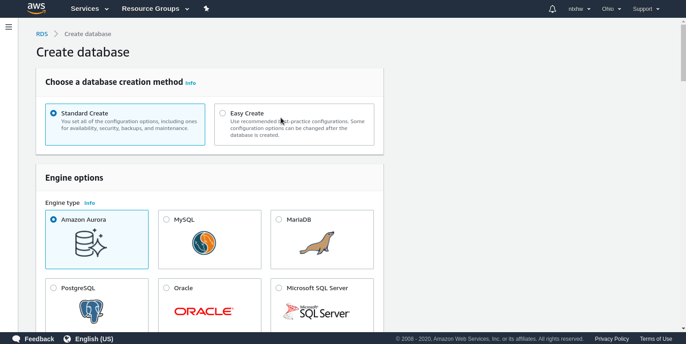

<h1>AWS RDS</h1>

<h1>Table of Contents</h1>

- [Introduction](#introduction)
- [Steps](#steps)
  - [Signing up to AWS](#signing-up-to-aws)
  - [Creating DB instance](#creating-db-instance)
  - [Allow for public connections](#allow-for-public-connections)
  - [Edit VPC Settings](#edit-vpc-settings)
  - [Connecting to your database](#connecting-to-your-database)
- [Conclusion](#conclusion)

# Introduction
If you're looking for some database hosts, Amazon Web Services (AWS) offers 12-months free relational databases and EC2 servers (as long as you stay under 750 hours every month). After 12 months, you must pay for the on a pay-as-you-go or on a reserved amount. This means if you have a single RDS instance, you may have it running 24/7 in a month at no charge. **If you have two instances, the 750 hours will be split between both instances, and you will run out sooner.**

**Signing up will require you to put in your credit card even if you are doing 12-months free**, so if you don't feel comfortable doing that you will have to look for another database hosting service. Almost all of them require some form of payment, so AWS RDS is the best one in my opinion.

# Steps
## Signing up to AWS
You'll have to sign up. Just follow through the sign-up process. It is all pretty standard. Once you've signed up:

1. Navigate to database on the left panel
2. Create an instance


## Creating DB instance
Here, go with **Easy Create** option

1. Select **Easy Create** option
2. Select the RDS you want (or search for it)
3. Select Free Tier
4. Create an admin/master username
5. Create an admin/master password
6. Click the big orange "Create Database" button

**I left these out in the steps when creating this guide on accident, but try to find the connection setting that allows public connections. Since RDS instances take so long to launch, I have decided to fix it later in this guide :)**



**Now all you have to do is wait for AWS to actually create your database and launch it**. This takes some time, so go grab a snack or watch an episode of your favorite TV show.

## Allow for public connections
Skip this step unless you've enabled it somewhere above. I've left it out on accident and refuse to wait another 30 minutes for a new instance to launch.

1. Click on your database instace name in the database view.
2. Click on Modify (should be top left somewhere)
3. Scroll down and click on **Additional connectivity configuration**.
4. Click on the big orange button to apply your changes
5. Click on **immediately** to apply the change as soon as possible
6. Click the big orange button again to go through with the change


## Edit VPC Settings
Allowing for public connections is not enough. You will need to whitelist which public connections you want to allow. **I've already done this, so I can only give very vague guidance**. You will probably want to resort to Google if you get lost.

1. Click on your database instance
2. Under networking, click on its VPC
3. On the left, go to security groups
4. Make sure teh security group for the VPC is check marked
5. Edit the inbound rules and outbound rules to include all traffic with destinations of `0.0.0.0/0`.


## Connecting to your database
Remember the admin username and password? I hope you do, because you'll need.

1. Click on your new database instance and grab its **endpoint** connection string and port.
2. Use the appropriate software to connect. Since I picked MariaDB as my database, I'm going to use the command line to connect to it.


There are many ways of connecting to a database, but the most simple way using the command line:

If you're on Windows, there are some connection software you can use.

On *nix, use:

```
$ mariadb -h <endpoint> -u <username> -p
```

Do not forgot the `-p` flag. This will prompt you to enter a password.


# Conclusion
I tried writing this guide using mostly what I've remembered, so if you get stuck somewhere or wonder "how the heck did he get there?", please resort to Google.

Remember, the free-tier only last 12 months, but it's a great RDS provider as long as you don't need to develop an API that's going to be querying the database with thousands upon thousands of calls. After that it's a pay as you go ($0.017 an hour I believe). These may change, so please view the AWS pricing calculator [here](https://calculator.aws/#/).
