<h1>Basics of Git and GitHub</h1>

<h1>Table of Contents</h1>

- [Introduction](#introduction)
  - [Installation](#installation)
- [Basic Usage](#basic-usage)
  - [Initializing](#initializing)
  - [Adding our new file so Git may track it](#adding-our-new-file-so-git-may-track-it)
  - [Commits](#commits)
  - [View the logs](#view-the-logs)
  - [Branching](#branching)
  - [Merging](#merging)
  - [Normal Cycle](#normal-cycle)
- [Working with Remote Repositories (GitHub)](#working-with-remote-repositories-github)
  - [Creating a new online repo](#creating-a-new-online-repo)
  - [Adding our remote repository to our git project](#adding-our-remote-repository-to-our-git-project)
  - [Push to the remote repository](#push-to-the-remote-repository)
  - [Creating a Pull Request](#creating-a-pull-request)
  - [Opening a PR](#opening-a-pr)
  - [Reviewing PR's](#reviewing-prs)
  - [Merging the PR to master](#merging-the-pr-to-master)
  - [Updating your local repository](#updating-your-local-repository)
- [Rebasing](#rebasing)

# Introduction
What is Git? From Wikipedia:

> Git is a distributed version-control system for tracking changes in source code during software development

[GitHub](https://github.com) is a platform in which you can host code that uses Git for source control management. This makes it easier for many people to write to a code base, and you can track who wrote which line of code.

## Installation
Installing `git` is really easy. See [here](https://git-scm.com/downloads). If you're using a *nix operating system, chances are you have a package manager. I recommend installing it via package manager. If you have [chocolatey](https://chocolatey.org/) for Windows, you may install it using that. If you're using Apple software, check out [Homebrew](https://brew.sh/).

You can also read this guide [here](https://rogerdudler.github.io/git-guide/). It shows how to use Git (no GitHub) pretty quickly, but assumes you've already got Git installed. I'd say read it in addition to this?

# Basic Usage
Let's say we have a directory called `some_project` with a single file `main.cpp`:

```
some_project
└── main.cpp
```

**This file is currently empty, but we will be adding to it**.

## Initializing
If we type `$ git status`, we can see that our project isn't set up to where it is being monitored by git. To start monitoring a project with git, initialize it with `$ git init`.

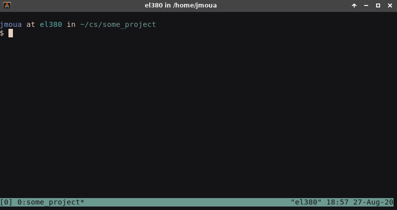

## Adding our new file so Git may track it
In order for Git to actually track the file, we must add it via `$ git add filename`. This will add it to the staging area in which you will later perform a "commit" (think of it to be a checkpoint).

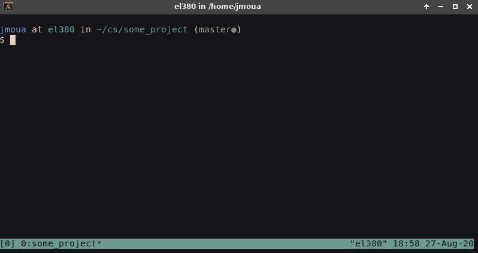

## Commits
After adding it, check the status of the project. We can see git has enlisted a new file called `main.cpp`. As mentioned above, the file is now in the staging area.

We can save these changes by performing a commit. All commits require some message, and this message is just what you've changed in the project.

Commits are made like this (**the `-m` is a message flag**):

```
$ git commit -m "your message here"
```

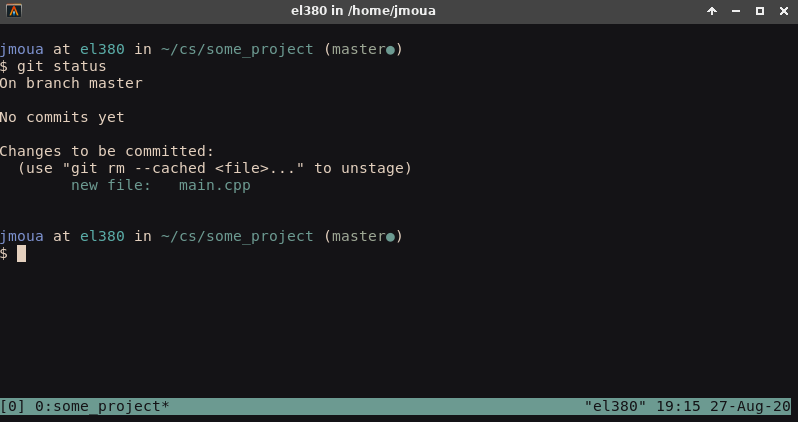

## View the logs
We can then view the logs via `$ git log`.

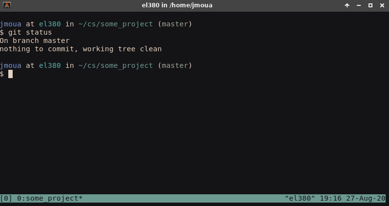

Viewing the logs will tell us all the commits made at exactly what time. We can even view each commit in detail if we wanted.

```
commit 634c929006b9ea5f70f71d1461795b4208bca751 (HEAD -> master)
Author: Jim Moua <jimmoua24@gmail.com>
Date:   Thu Aug 27 19:15:47 2020 -0500

    Added main.cpp file
```

## Branching
The main branch is called the **master** branch. You can usually change the name of the master branch, but many just leave it named master.

**Why branch?** We branch because we will often be adding new features to our project. We do not want to commit changes to the directly to the master branch because things seldom go the way we want in software development. Therefore, we want to branch off the master branch and develop our new features in a separate branch. After implementing these new features in a separate branch and after testing it to make sure it works properly alongside not breaking anything, we can then merge it with the master branch.

|              Command              |                  Description                  |
| :-------------------------------: | :-------------------------------------------: |
|   `$ git branch <branch_name>`    | creates a branch based off the current branch |
|  `$ git checkout <branch_name>`   |              switch to a branch               |
|  `$ git branch -D <branch_name>`  |                delete a branch                |
| `$ git checkout -b <branch_name>` |     create a new branch and switch to it      |

In my example, I want to print "Hello, world!", so I will do the following:

1. **Create a branch from the master branch and switch to it**
    
2. **Implement our new feature so our program prints hello world**

    Modify the `main.cpp` file to this:
    ```c++
    #include <iostream>

    int main() {
      std::cout << "Hello, world!\n";
      return 0;
    }
    ```
3. **Add our modified `main.cpp` to the staging area and commit it with a "good" message**
    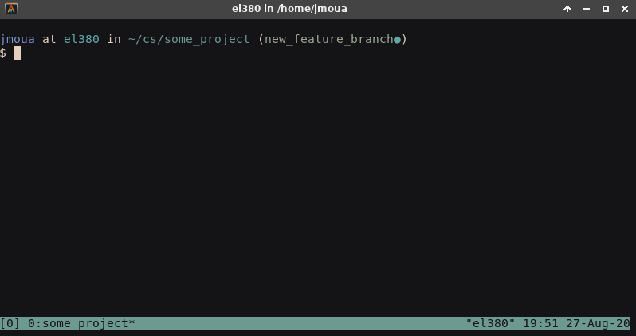

    Our git log should now contain two commits:

    ```
    commit c524c43435f6abf082adae578b0ab0ad430b938c (HEAD -> new_feature_branch)
    Author: Jim Moua <jimmoua24@gmail.com>
    Date:   Thu Aug 27 19:51:40 2020 -0500

        Added new features

    commit 634c929006b9ea5f70f71d1461795b4208bca751 (master)
    Author: Jim Moua <jimmoua24@gmail.com>
    Date:   Thu Aug 27 19:15:47 2020 -0500

    Added main.cpp file
    ```

## Merging
After we are done with implementing our new feature, switch back to the master branch and merge it with the feature branch.*

```
$ git merge <merge_with_branch>
```

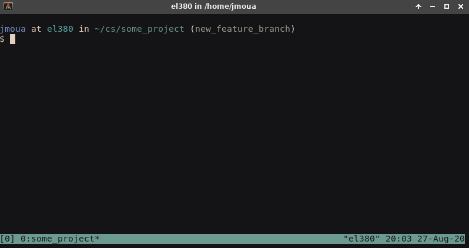

Sometimes, you will have to deal with merge conflicts, but I'm not going to cover that. I think GitHub has a pretty good article on how to resolve merge conflicts [here](https://docs.github.com/en/github/collaborating-with-issues-and-pull-requests/resolving-a-merge-conflict-using-the-command-line).

\* Unless you are working by yourself, you usually will not be merging branches like this, but merging via a PR (pull request) on GitHub.

## Normal Cycle
You'll pretty much be following this cycle (or something similar):

1. You need to implement a new feature
2. You create a branch off the master branch to create said new feature
3. You make changes to project to incorporate the new feature
4. You test the new feature to make sure it doesn't break anything
5. You add changed/new files to the staging area via `git add <filename>`
6. You commit the changes with a message using `git commit -m "some message"`
7. You merge the new feature to the master branch
8. back to step 1

# Working with Remote Repositories (GitHub)
We will be using [GitHub](https://github.com) for this example.

To host a project on GitHub, you must have initialized your project with Git. Simply create the online repository on the website.

## Creating a new online repo
Navigation GitHub is pretty easy, so:

1. Click on new
2. Give the online repository a name

**Note**: the repository name does not have to match the actual project name that you have on file and can be whatever as long as the name does not conflict with an already existing repository under your account.

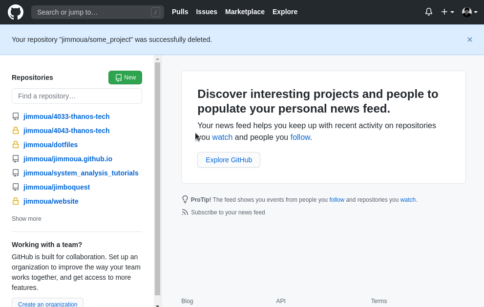

## Adding our remote repository to our git project
We will be using https in order to push our code to the repo. You can use ssh, but that will require additional setup. Read about it [here](https://docs.github.com/en/github/authenticating-to-github/connecting-to-github-with-ssh).

If you live on campus, ssh to other servers that does not belong to the university (basically if it isn't the boole.cs.atu.edu) are blocked. The only way I have been getting around it is using a VPN, but not everyone has access to a VPN. Therefore, I will be using https in this guide.

Because we already have our repository, all we need to do is add it with this command.
```
$ git remote add origin https://github.com/jimmoua/some_project
```


## Push to the remote repository
Pushing is just a uploading all your files to the remote repository. You will be prompted to enter in your credentials. Each push will require credentials, but you can set up it to where you don't have to provide credentials every time by saving your credentials somewhere. I'm not sure how Windows does this, but I've been using ssh. You'll have to find out what works for you if you don't want to enter your GitHub username and password for every push.

```
$ git push -u origin master
```

Note that we were in the master branch when we did a push. The flag `-u` sets the default push branch to be origin master, so we when perform a push on our local branch master, these pushes will be uploaded to the master branch of our online repository. We really only need to set the upstream branch once (unless you want to change the online branch your local branch pushes to), so you do not have to specify the `-u` flag in later pushes.

**Note**: if you create a new local branch and want to push it to an online repository, you will first have to specify the online repository branch it will be pushed to. This online branch must share the same name as the local branch, so if I create a local branch called `new_feature`, I have to set its upstream branch like this:

```
$ git push -u origin new_feature
```

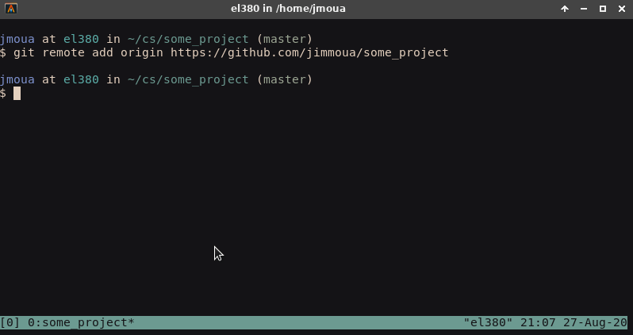

## Creating a Pull Request
Pull requests are often abbreviated as PR. Here is a scenario in which you might make one:

1. You want to implement a feature
2. You branch off master
3. Implement said feature in your new branch
4. Push your local branch to the online repo
5. Open up a PR
6. Have your team review your code
7. Fix your code (if it is broken)
8. Merge the code

Here is a GIF to show how it can be done:

**Let's add a feature so `Hello, world!` prints a few more times**. In the GIF below, we create and switch to a branch that will contain this feature, implement it, and then push it to the online repository.


## Opening a PR
We can now view the branch on GitHub and open up a PR.

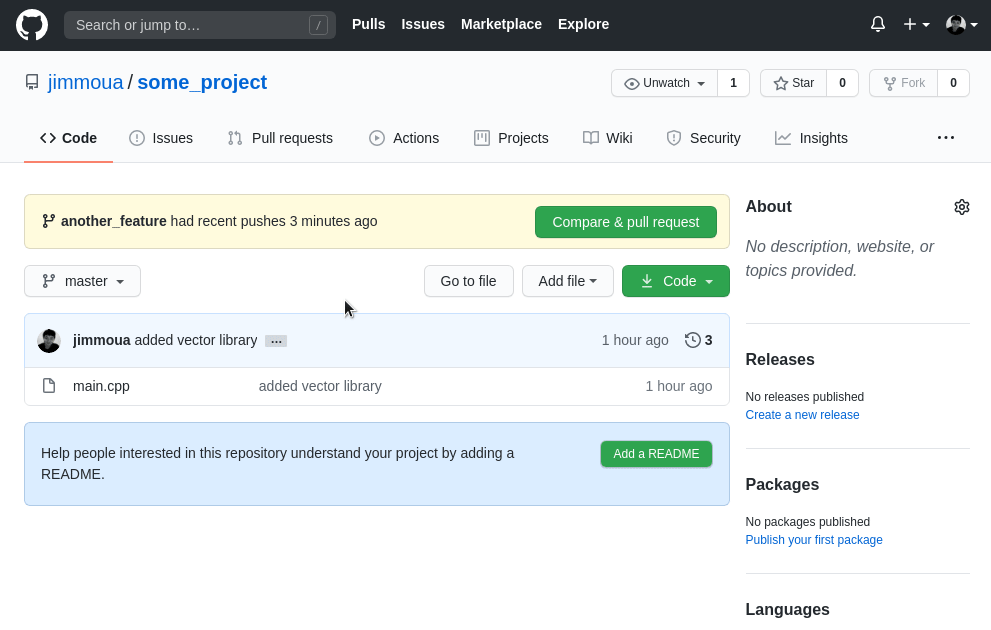

## Reviewing PR's
Once the PR has been opened up, you can tell your teammates to review your code. If you go to the `Files changed` tab, you can see what they have changed or added. You may also select the codes in your browser and comment on it or suggest something.

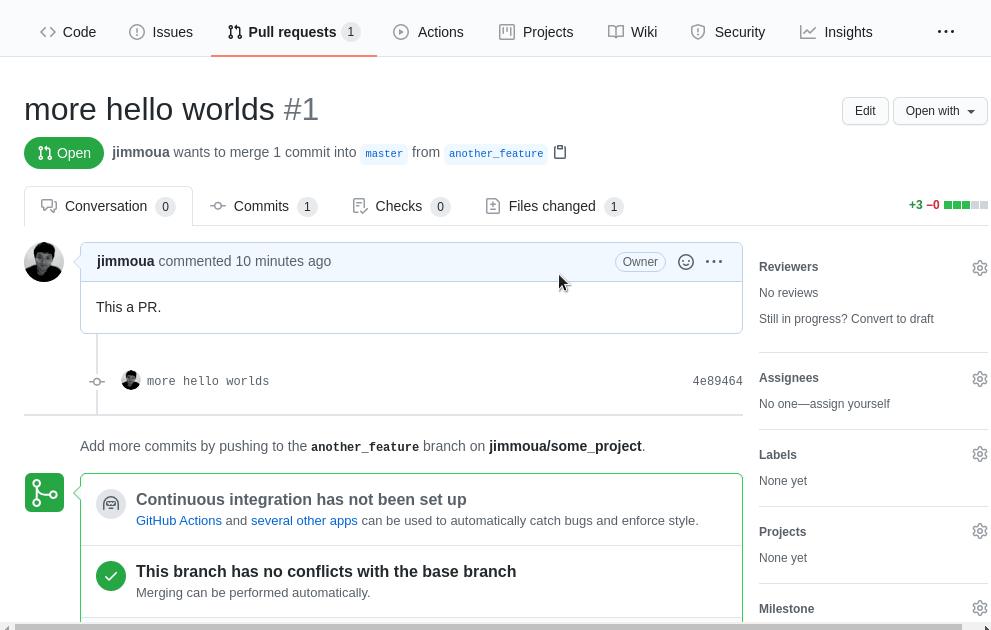

## Merging the PR to master
I generally like to **rebase and merge** instead of **creating a merge commit**. There are two ways of merging branches in Git:

1. `git rebase`
2. `git merge`

For this guide, I'm going to rebase and merge to master. If you're curious about them, Medium has a good article on it [here](https://medium.com/datadriveninvestor/git-rebase-vs-merge-cc5199edd77c#:~:text=When%20you%20do%20rebase%20a,the%20master%20branch%20is%20changed.&text=Merging%20adds%20a%20new%20commit%20to%20your%20history.).

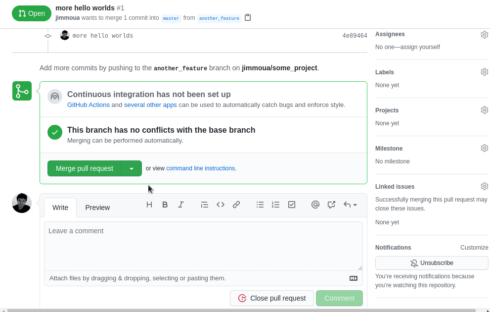

## Updating your local repository
If you are working in a team, chances are your local repository may be out of date. You will have to switch to that branch, check the online repos for any changes, and then update your local repos.

1. `$ git checkout master` - switch branch
2. `$ git fetch` - check online repo
3. `$ git pull` - update local repo

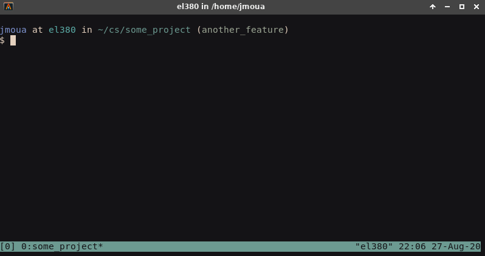

# Rebasing
Rebasing is another way of merging. [This](https://blog.scottlogic.com/2020/01/09/git-rebasing.html) article is a pretty good read on rebasing, so I'd say give it a read.
 
Let's say you are working on a feature and you commit your changes often. But these changes are small and now you've got a ton of commit messages in your logs for that specific feature branch. These logs are meaningful (or meaningless), but they will flood up the master branch log if you decide to merge them without doing rebasing.

This is where `$ git rebase` comes in. Rebasing allows us to add/edit/remove commits.

|               Command                |                            Description                            |
| :----------------------------------: | :---------------------------------------------------------------: |
|       `$ git rebase <branch>`        |                         Performs a rebase                         |
|      `$ git rebase -i <branch>`      | Performs an interactive rebase (you choose which commits to edit) |
|   `$ git rebase --abort <branch>`    | If you've messed up in your rebase, this will abort it and reset  |
| `$ git reset --hard origin/<branch>` |         Resets the local branch to match upstream branch          |

The last one isn't really a rebase, but rather a big eraser for big mistakes.

In this upcoming scenario, I've added a bunch of `Hello, world!` outputs and removed the `vector` library, but my logs are hideous and needs some cleanup.

All these small messages may be something like `fixed a typo`, `typo fixed # 2`, `remove dependency foo`, and/or `added additional functionalities to class`. Something like:


To bundle these commits into a single commit, run the rebase in interactive mode and select which commits to **fixup** or **squash** (depending on what you want to do with the commit).

I will rebase off `origin/master`. This means that I will be editing commits that are made after any commits in the upstream repository of the master branch.

In the below, I reworded a commit and "squashed" another. When I check the logs after rebasing, they have gotten shorter.

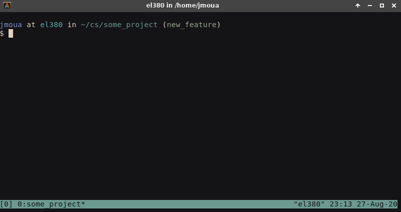

When rebasing you'll probably be wanting one of these:

| Command | Shortcut | Description                                                |
| :-----: | :------: | :--------------------------------------------------------- |
|  pick   |    p     | pick the commit to use in the logs                         |
| reword  |    r     | reword/edit the commit message                             |
|  fixup  |    f     | Use the commit, but discard the log                        |
| squash  |    s     | Use the commit log, but bundle it with the previous commit |
