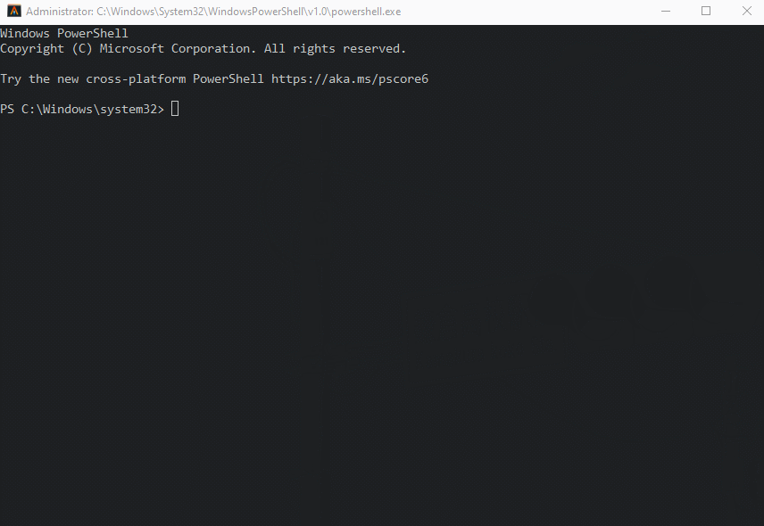
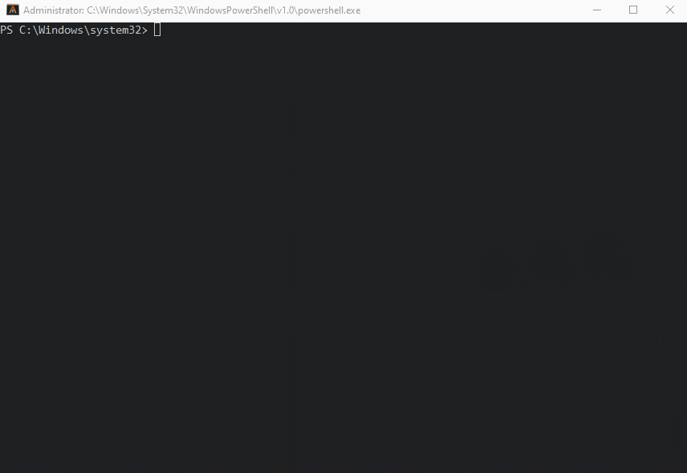
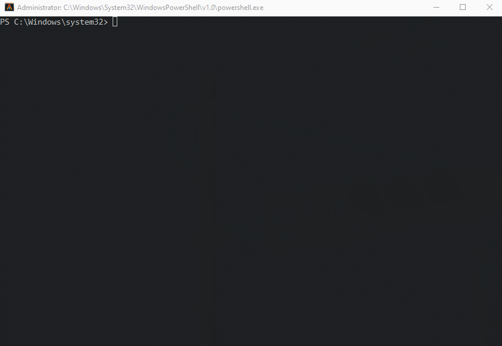

<h1>Table of Contents</h1>

- [Installation](#installation)
  - [Install using an installer](#install-using-an-installer)
  - [Installation via package manager](#installation-via-package-manager)
  - [Installation using Node Version Manager](#installation-using-node-version-manager)
    - [Install a version of NodeJs and use that version](#install-a-version-of-nodejs-and-use-that-version)
  - [Verifying Installation](#verifying-installation)

# Installation
You can visit their [website](https://nodejs.org/en/download/) and install it using an installer. If you're on MacOS or on a variant of Linux, your best bet is using your package manager.

I prefer to use the **node version manager** or **`nvm`**. This way, if you are working on projects that vary in NodeJs versions, you can simply switch using the `nvm` command.

## Install using an installer
This one is probably the most straightforward approach. You can go to their downloads page (https://nodejs.org/en/download/) and click on a version you want. This is probably the easier on Windows machines that are not using any package managers.

## Installation via package manager
See [here](https://nodejs.org/en/download/package-manager/#debian-and-ubuntu-based-linux-distributions-enterprise-linux-fedora-and-snap-packages).

## Installation using Node Version Manager
My preferred way of using NodeJs is via the Node Version Manager (`nvm`), which obviously manages different versions of NodeJs. This can be very helpful if you're working with other projects that use a different version of NodeJs.

Here, I am on Windows using the Chocolatey package manager to install `nvm`. **Be sure to run your shell (if on Windows) with administrator privileges or you will not be able to install anything**.



### Install a version of NodeJs and use that version

You can view a list of NodeJs released versions [here](https://nodejs.org/en/download/releases/).

For this guide, I'm going to install version `14.5.0`. **Installing a certain version of NodeJs will also install the Node Package Manager software (`npm`) that comes with that version of NodeJs.**

Install it using the command
```
$ nvm install 14.5.0
```

And then tell `nvm` to use that version
```
$ nvm use 14.5.0
```



## Verifying Installation
If you can type

```
$ node -v
$ npm -v
```

and have it return your versions, then you have successfully installed NodeJs.

